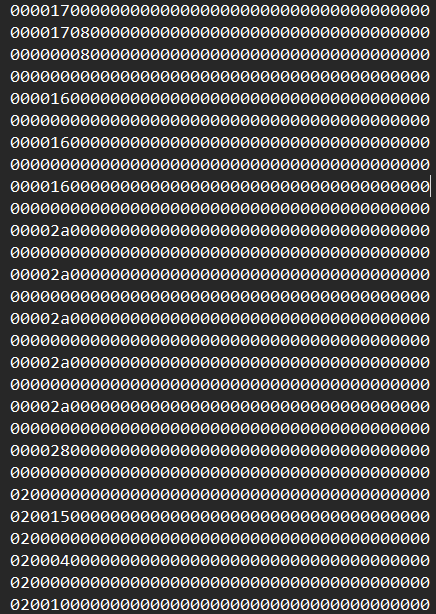

diberikan sebuah file berisi file packet pcapng

saat dibuka, sepertinya filenya berisi logger


untuk setelah observasi, ditemukan leftover capture data pada tiap datanya 

maka dari itu, saya menggunakan tshark untuk mengekstrak datanya dengan command berikut 

```
tshark -r .\packet.pcapng -Y 'usb.capdata && usb.data_len' -T fields -e usb.capdata
```

kemudian keluar datanya 



setelah itu, saya perbaiki datanya dengan menambahkan : untuk membaca keystrokenya, dengan sedikit sihir menggunakan chatgpt, datanya berhasil di perbaiki

dan memasukkan datanya menggunakan script usb keyboard parser di github 


dan keluarlah flagnya 
RAMADAN{easy_K3yb0ard_HID_us4Ge}
